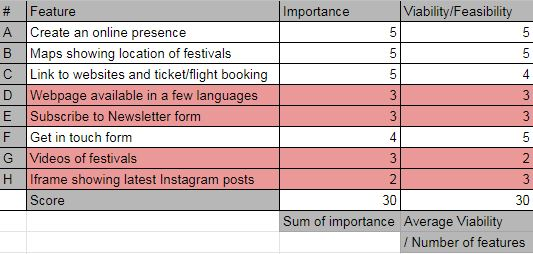
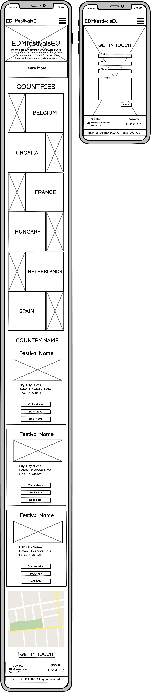
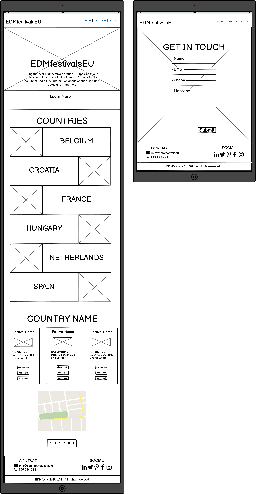

# EDMfestivalsEU

[Visit site here](https://marctell92.github.io/https://marctell92.github.io/edmfestivalseu-ms2/)

This website offers basic information about the main EDM festivals around Europe such as the location, dates and artists. It aims to be a guide to all Electronic Dance Music fans who are in search of the main events in the continent.
This website is mobile-first design and it's fully responsive and accessible on a vast range of devices, making it easy to navigate for all kinds of users.
 
## User Experience (UX)

### Strategy Plane
#### Target audience for EDMfestivalsEU:

- Users aged 16-40, given the fact that Electronic Dance Music is more extensive between this age range.
- Users interested in Electronic Dance Music.
- Users interested in music events, specially big festivals.
- Users interested in planning their vacation or weekend getaway around a music festival in Europe.
- Users interested in finding information about an specific festival.
- Users interested in booking tickets for EDM festivals in Europe.
- Users interested in booking flights to the specific EDM festival destination.
- Users interested in getting in touch with EDMfestivalsEU.

#### Business Goals

Allow users to find the best EDM festivals in Europe.
Present the website on a user-friendly form, where information can be absorbed easily.
Help the user understand the information displayed within the first visit to the website.
Help the user plan their attendance to a festival by giving links to tickets and flight purchases.
Connect with potential collaborators to expand the concept and services and collect fedback with the contact form.

#### User stories 
- ##### As a First Time Visitor, I want to...
    - Easily understand the content in order to find the information I'm looking for.
    - Easily navigate and find content through the website in an user-friendly way.
    - Find visual resources that support and complement the content.
    - Have the possibility to get in touch with EDMfestivalsEU and have access to their Social Media links.

- ##### As a Returning Visitor, I want to...
    - Find the familiar interface and layout which I already experienced.

#### Features consideration

We've used the below table to consider which features was worth adding, considering their
importance and the viability of implementing them. The ones highlighted in red were left on the side 
to be considered in the future.

### Scope Plane

Minimal Viable Product for this project is a website with at least the below features;

- Navigation Bar on desktop and tablet screen, hamburger on mobile.
- Contact submission form
- Social Media Links
- Interactivity unfolding the list of festivals for each country.
- Google Maps API showing location for each festivals.
- Buttons linking to tickets and flight reservations.
- Email JS API to submit contact form.

### Structure Plane
- The website has a landing main page and a "Get in touch" page.
- The user can navigate through the different sections of the landing and "Get in touch"page
using a navigation bar on desktop and tablet screen versions.
- The user can navigate through the different sections of the landing and "Get in touch"page
using a hamburger on mobile screen versions.
- The landing page is composed of a header, navigation bar, hero image, country section and a footer.
- The "Get in touch" page is composed of a header, navigation bar, contact submission form and a footer.

### Skeleton Plane
- Mobile Screen
    - 
- Tablet Screen
    - 
- Desktop Screen
    - 

### Surface Plane
This website aims to give a festival lights feeling.
Creative design has been applied in order to adapt to this look and feel.
 
- Colors: #4e1f32, #e78ba8, #dedede
- Fonts: Chakra Petch and Bai Jamjuree
- Images
    - The Hero image aims to set the color palette of the website and give a festival crowd feeling.
    - Country images aim to allow the user to identify hich country is going to be selected.
    - Festival images aim to reflect the ambience on each festival.

    ## Features
### Existing Features
- Responsive on all devices: allows the user to navigate comfortably on the page regardless of the device type used.
- Navigation Bar and hamburger: allows the user to navigate through the web sections and pages with ease.
- Countries section: allows the user to interactively search festivals by country.
- "Get in touch" form: allows the user to contact with EDMfestivalsEU.
- Map: allows user to locate each festival.
- Footer: allows users to access the different social media channels of EDMfestivalsEU.

### Features Left to Implement
- Other languages page version.
- "Subscribe to Newsletter" submission form on a separate page.
- Video section of festivals
- Iframe with the last Instagram posts by Elsewhere. 

## Technologies Used
### Languages
- HTML5
- CSS3
- Javascript

### Frameworks, Libraries & Programs Used
- [Github](https://github.com/): used to store the projects code.
- [Gitpod](https://gitpod.io/workspaces): used for version control.
- [Bootstrap v5.0.0.](https://getbootstrap.com/docs/5.0/getting-started/introduction/): used to assist with the responsiveness and styling of the website.
- [Balsamiq](https://balsamiq.com/): used for wireframe design.
- [jQuery v3.5.1](https://jquery.com/): used to implement interactivity on the page.
- [Google Maps API](https://developers.google.com/maps): used to render map with festival locations.
- [EmailJS](https://www.emailjs.com/): used to connect "Get in touch form" with email.
